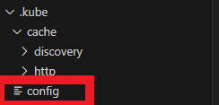
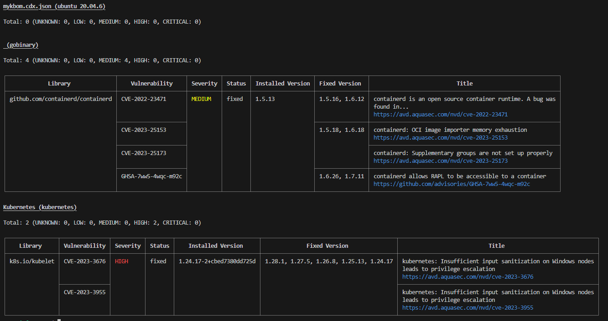
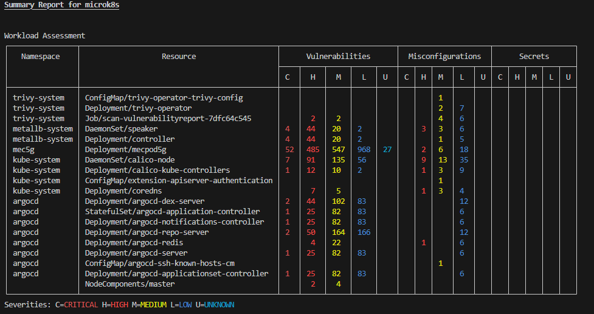
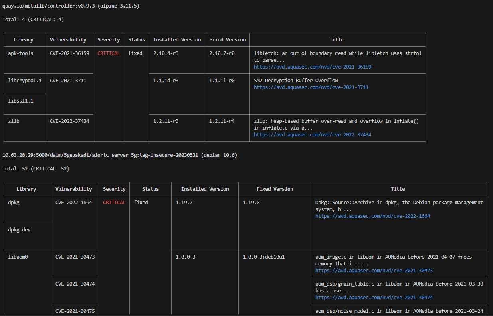
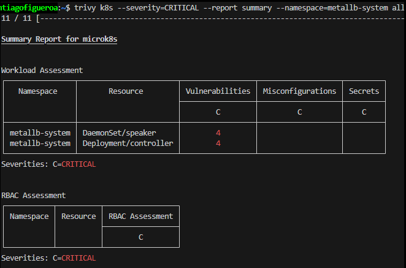

# KBOM

The current project aims to describe a brief how-to tutorial for deploying KBOM in a Ubuntu 20.04 that has a K8S cluster installed and running.

## Prerequisites

We need to have a Ubuntu 20.04 server installed and a K8s cluster running in it. 

## Deployment

To use KBOM, we need to install first trivy from AQUA:

```
sudo apt-get install wget apt-transport-https gnupg lsb-release
wget -qO - https://aquasecurity.github.io/trivy-repo/deb/public.key | gpg --dearmor | sudo tee /usr/share/keyrings/trivy.gpg > /dev/null
echo "deb [signed-by=/usr/share/keyrings/trivy.gpg] https://aquasecurity.github.io/trivy-repo/deb $(lsb_release -sc) main" | sudo tee -a /etc/apt/sources.list.d/trivy.list
sudo apt-get update
sudo apt-get install trivy
```

Once we have it installed, we need to get the Kubeconfig of our custer, and save it. Remember the path, because we will need it to execute the commands. Note: we will need to add the following after weach trivy command: --kubeconfig PATH_TO_KUBECONFIG

If you want to avoid telling the path everytime, you can save the kubenconfig in: $HOME/.kube in a file which name is config:

| |
|:-:|
| *Figure : Kubeconfig.* |

Then, we need to create the KBOM in CycloneDX format:
```
trivy k8s cluster --format cyclonedx --output mykbom.cdx.json
```

Them we can use that file to search for cluster vulnerabilities:
```
trivy sbom mykbom.cdx.json
```

| |
|:-:|
| *Figure : Cluster Vulnerabilities.* |

We can also see the vulnerabilities of the resources inside it:

```
trivy k8s --report=summary cluster
```

| |
|:-:|
| *Figure : Resources vulnerabilities.* |

We can filter the vulnerabilities.

Filter by severity:
```
trivy k8s --severity=CRITICAL --report=all cluster
```

Filter by scanners (Vulnerabilities, Secrets or Misconfigurations):
```
trivy k8s --scanners=secret --report=summary cluster
```

```
trivy k8s --scanners=config --report=summary cluster
```

NOTE: if we can see the vulnerabilites in detail, use --report=all.

Here we can see the CRITICAL vulnerabilities in detail:

| |
|:-:|
| *Figure : Resources vulnerabilities in detail.* |

We can also only check for a specific namespace:
```
trivy k8s --scanners=config --report=summary --namespace=metallb-system all
```

| |
|:-:|
| *Figure : Resources vulnerabilities in a namespace.* |