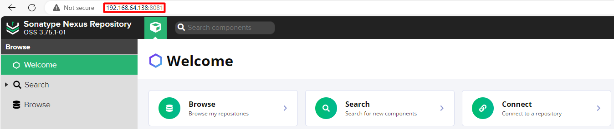
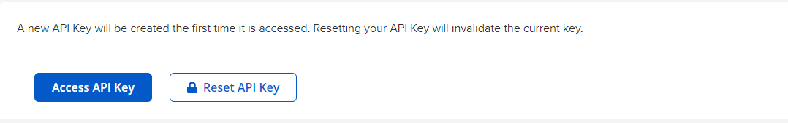

# SBOM test


## SBOM registry deployment

1. Deploy Nessus service:

    ```console
    docker pull sonatype/nexus3
    docker volume create nexus-data
    docker run -d -p 8081:8081 --name nexus -v nexus-data:/nexus-data sonatype/nexus3
    ```
2. Open Nessus GUI

    

3. Find the current password inside of the container in `/nexus-data/admin.password`

4. Update the password

5. Enable anonymous access

6. Copy the API Key in `admin/NuGet API Key`

    