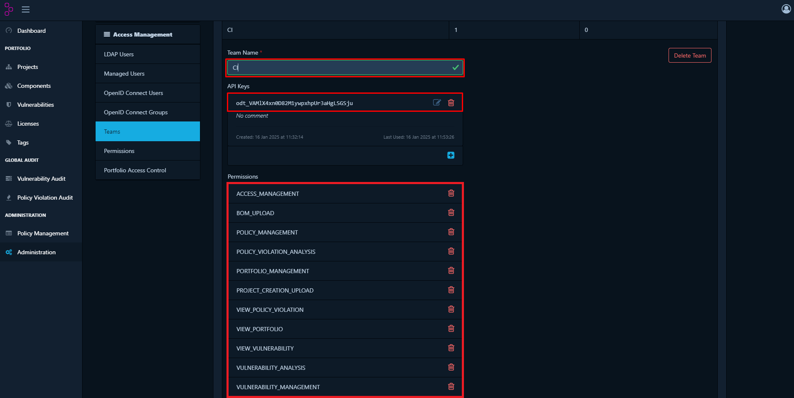
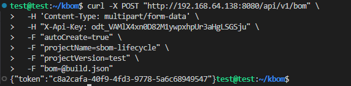

# SBOM Lifecycle

1. Deploy Dependency Tracker

```console
docker run -d -m 8192m -p 8080:8080 --name dependency-track -v dependency-track:/data -e JAVA_OPTS="-Xmx4096m" dependencytrack/bundled
```

2. Create a API_KEY, with necessary permissions


3. Test a SBOM

```console
curl -X "POST" "https://YOUR_IP_DT:8080/api/v1/bom" \
     -H 'Content-Type: multipart/form-data' \
     -H "X-Api-Key: YOUR_API_KEY" \
     -F "autoCreate=true" \
     -F "projectName=sbom-lifecycle" \
     -F "projectVersion=test" \
     -F "bom=@sbom.json"
```


4. Use an [extremely-vulnerable-flask-app](https://github.com/manuelz120/extremely-vulnerable-flask-app) for testing purpose:

```console
tree -d
.
├── conf
├── forms
├── models
├── routes
├── static
├── templates
│   └── partials
└── utils
```
5. Add Dependency Track interaction from pipeline

```console
stages:
  - source
  - sbom_source

trivy_sbom_source:
  stage: source
  image:
    name: aquasec/trivy:latest
    entrypoint: [""]
  variables:
    TRIVY_NO_PROGRESS: "true"
  tags:
    - sbom
  script:
  - trivy --insecure --scanners vuln --format cyclonedx --output source.json fs .
  artifacts:
    paths:
      - source.json

sbom_upload:
  stage: sbom_source
  needs:
    - tryvy_sbom_source
  variables:
    GIT_STRATEGY: none # only artifacts from previous jobs
  script:
    - | 
      curl -X "POST" --fail "https://${DEPENDENCY_TRACK_API_HOST}/api/v1/bom" \
      -H "Content-Type: multipart/form-data" \
      -H "X-Api-Key: ${DEPENDENCY_TRACK_API_KEY}" \
      -F "autoCreate=true" \
      -F "projectName=gilab-ci-test" \
      -F "projectVersion=${CI_COMMIT_BRANCH}" \
      -F "bom=@sbom.json"
```
